<div align="center">

# ScopeShift
### Deterministic Evidence Governance &amp; Requirements Verification Engine

> **"Seeing a button is not approving the button."**  
> Decoupling multi-modal LLM extraction from specification authority through code-level citation proofs and tamper-evident event streaming.

[-orange?style=flat-square)](#problem-statement-alignment-p42)
[](https://www.python.org/)
[-emerald?style=flat-square&logo=pytest&logoColor=white)](tests/)
[](#the-governed-pipeline)
[](#immutable-event-ledger)
[](#enterprise-cloud-architecture)
[](LICENSE)

<br/>



</div>

---

## Executive Overview

Modern software teams and autonomous AI coding agents face a critical drift vulnerability: **unauthorized visual scope creep**. When an engineering staging UI, mock, or chat snippet introduces a feature, current AI tools silently bake it into requirements specifications—treating mere visual observation as stakeholder approval.

**ScopeShift establishes a strict, verifiable boundary:**
1. **Extraction is decoupled from authority:** Multi-modal foundation models (Gemini 3.6 Flash / Vertex AI with automatic fallback to Gemini 3.5 Flash) extract structured claims, but are never permitted to make governance decisions.
2. **Code enforces citation integrity:** Every cited quote must match verbatim in the source document. Every UI screenshot must fall within physical bounding boxes. Dangling or hallucinated citations fail closed.
3. **Deterministic resolution:** Requirements advance into the published Business Requirements Document (BRD) strictly when an authorized, verified client decision explicitly mandates them.

### Problem Statement Alignment (P42)

> **Challenge Track:** Commudle HackSprint Phase 2 &bull; **Problem Statement 42 (P42)**  
> **Core Objective:** Build a deterministic, evidence-governed requirements system that halts autonomous AI drift, eliminates hallucinated citations, and prevents unauthorized observations from altering software specifications without cryptographically verifiable client authority.

---

## The Governed Pipeline

```
Evidence Artifacts ──► Verbatim Citation Gate ──► Append-Only Event Store ──► Deterministic Resolver ──► Governed BRD Spec
(PDF / PNG / Notes)       (Fail-Closed Code)          (Monotonic SHA-256)        (Pure State Machine)     (Live Projection)
```

| Pipeline Stage | Function | Guarantees |
|---|---|---|
| **1. Multi-Modal Ingestion** | Extracts candidate claims from PDFs, UI screenshots, and client messages. | Constrained schema extraction. Deterministic offline fallback preserved for zero-downtime reliability. |
| **2. Verbatim Citation Gate** | Code-level substring proof and spatial pixel bounding validation. | Fail-closed. Rejects fabricated quotes, forged scopes, and out-of-bounds bounding boxes with structured rejection receipts. |
| **3. Immutable Event Ledger** | Sequences mutations into an append-only log with SHA-256 cryptographic hash chains. | Monotonic ordering with SQLite atomic concurrency guards. Dual-writes to Google BigQuery streaming log. |
| **4. Deterministic Resolver** | Projector keyed by claim ID that computes conflict matrices and resolves governing authority. | Mathematical determinism: identical event sequences always yield identical requirements state. |
| **5. Governed BRD Document** | Generates authoritative markdown specifications with full audit lineage. | Real-time diff against baseline, governing source attribution, and superseded baseline references. |

---

## Core Capabilities

### 🛡️ Fail-Closed Citation Proofs
AI extractors cannot hallucinate authority. If a model generates a citation whose quote does not appear verbatim in the source payload, the ingestion boundary rejects the payload with an immutable rejection receipt (`UNVERIFIED_QUOTE`). Visual observations (`screenshot`) are permanently classified as non-authoritative.

### 👁️ Visual Provenance Diff Inspector
Clicking the governance banner in the Cockpit launches an interactive modal displaying side-by-side evidence cards for the active claim:
- Baseline BRD requirements vs staging UI observations vs client statements.
- Direct quote spans, image bounding-box overlays, and authority tier indicators.
- Live resolver rationale explaining why a claim is withheld or promoted.

### 🎯 1-Click Scenario Presets
Test the real validation pipeline and state machine with single-click production scenarios:
- **Security Mandate (`mfa`):** Baseline BRD specifies optional MFA &rarr; Client directive enforces TOTP &amp; SMS &rarr; Promoted to `GOVERNED`.
- **Scope Change (`currency`):** Baseline INR policy &rarr; Client switches to multi-currency USD &rarr; Replaces baseline as `GOVERNED`.
- **Adversarial Injection (`hostile`):** Injects fabricated quotes, forged scope overrides, and unregistered claims &rarr; Safely contained at the boundary.

### 🌐 3D Spatial Evidence Twin
Interactive Three.js visualizer rendering requirements topology in 3D coordinate space. When unverified staging evidence contradicts baseline documentation, a physical red vector clash barrier halts progression—visually demonstrating why observation is never approval.

### ⛓️ Cryptographic Audit Ledger &amp; BigQuery Stream
Every state change is recorded in an append-only event store. Each event calculates a SHA-256 digest over its sequence, payload, timestamp, and the preceding event's hash. The browser UI features a client-side **Verify Hash Chain** tool that recalculates the entire chain independently.

---

## Three-Stage Governance Lifecycle

The system enforces a strict 3-stage lifecycle demonstration:

```
[ STAGE 01: DISPUTED ] ────────► [ STAGE 02: GOVERNED ] ────────► [ STAGE 03: DISPUTED ]
Baseline BRD: UPI only           Client Note: Card authorized      Client revokes decision
UI shows Card button             Enters BRD with governing ref     Withdrawn from BRD immediately
Result: Requirement Withheld     Baseline marked SUPERSEDED        Forensic history preserved
```

---

## Operational Modes: Live vs Offline

ScopeShift is fail-closed and works completely offline without network or credentials. Here is what is live vs offline:

| Component | Offline Mode (Default / No Credentials) | Live Mode (With API Key & GCP Credentials) |
|---|---|---|
| **Event Ledger & Hash Chain** | Live SQLite (`./events.db`) append-only monotonic SHA-256 chain | Live SQLite + dual-write streaming mirror to Google BigQuery |
| **Claim Ingestion & Validation** | Deterministic code validation gate; SHA-256 verified fixtures for demo replay | Google Gemini API (`GEMINI_API_KEY`, default: `gemini-3.6-flash`, fallback: `gemini-3.5-flash`) or Vertex AI (`google-genai` SDK with `vertexai=True`) |
| **Screenshot Verification** | Real image header dimensions + bounding check; verifier fails closed without model | Pillow crop + separate Gemini transcription call + code-level string match |
| **Approver Governance** | `approvers.json` allowlist validation; untrusted senders demoted to observations | Same: cryptographic audit log with sender, channel, and timestamp |
| **Artifact Storage** | Local file serving (`/fixtures/*`) | Google Cloud Storage (GCS) upload + signed URLs |
| **Conflict Resolver & BRD** | 100% deterministic local state machine; pure function over event log | Same: 100% deterministic local state machine (Gemini proposes, code decides) |

---

## Quickstart

### One-Command Quickstart
```bash
# Automated launcher (starts server, polls /api/health, opens browser)
python run_demo.py
# or Windows PowerShell:
.\run_demo.ps1
# or direct server launch:
pip install -r requirements.txt && python demo_server.py
```
Open **`http://localhost:8765`** in your browser.

- **Persistence Mode:** Persistence is enabled by default to `./events.db` (`SCOPESHIFT_DB` env var). `/api/health` reports `{"persisted": true}`.
- **Demo Safe Mode:** Toggle the **`🛡 Safe Mode`** button in the header (or launch with `--safe-mode`) to force deterministic offline fallback on stage for 100% resilient presentations.
- **Keyboard Shortcuts:** Press `1`, `2`, or `3` to instantly step through the 3 governance stages.
- **Automated Walkthrough:** Click `▶ Automated Walkthrough` in the header for a timed automated walkthrough.

### Verification & Smoke Scripts
The test suite runs with zero external dependencies (fail-closed, 100% offline):
```bash
python -m pytest -q
```

When `GEMINI_API_KEY` is available, verify live multimodal extraction (text, PDF, image) and model fallback:
```bash
python scripts/smoke_live.py
```

To run concurrent scale stress testing (e.g. 50 requests across 10 threads) with cryptographic chain validation:
```bash
python scripts/load_test.py -n 50 -t 10
```

To verify Google Cloud service connectivity (Vertex AI, Cloud Storage, BigQuery):
```bash
python scripts/verify_cloud.py
```

> [!NOTE]
> **Benchmark Status:** Plainly stated: the live comparative benchmark has not been run; `benchmark/results.md` and `benchmark/results.json` do not exist yet. Run `python benchmark/run_benchmark.py` once quota or billing is available to generate unedited benchmark results.

### Optional Live Configuration
ScopeShift is built **fail-safe and offline-first**. All features function locally out-of-the-box. Optional live Gemini and GCP integrations activate automatically when environment variables are present:

```bash
# Gemini model settings (defaults to gemini-3.6-flash, fallback: gemini-3.5-flash)
export GEMINI_API_KEY="your-gemini-api-key"
export SCOPESHIFT_GEMINI_MODEL="gemini-3.6-flash"
export SCOPESHIFT_GEMINI_FALLBACKS="gemini-3.5-flash,gemini-2.5-flash"

# Optional shared-secret auth & webhook secret
export SCOPESHIFT_API_TOKEN="optional-bearer-token"
export SCOPESHIFT_WEBHOOK_SECRET="optional-webhook-secret"

# Google Cloud Platform settings
export GOOGLE_APPLICATION_CREDENTIALS="/path/to/key.json"
export SCOPESHIFT_BQ_DATASET="scopeshift_audit"
export SCOPESHIFT_GCS_BUCKET="scopeshift-artifacts"
export GOOGLE_CLOUD_PROJECT="your-project-id"
export GOOGLE_CLOUD_LOCATION="us-central1"
export SCOPESHIFT_APPROVERS="./approvers.json"
```

Check connection status at any time via `GET /api/cloud/status` or the live backend indicator cluster in the navigation bar.

---

## Test Architecture
 
| Test Module | Coverage Scope |
|---|---|
| [`tests/test_core.py`](tests/test_core.py) | Domain claim registries, schema validators, invariant rules, and deterministic state transitions. |
| [`tests/test_store.py`](tests/test_store.py) | Monotonic sequence assignment, SHA-256 hash chains, trigger guards, and concurrent race integrity. |
| [`tests/test_extraction.py`](tests/test_extraction.py) | Structured Gemini schemas (gemini-3.6-flash default, gemini-3.5-flash fallback, typed fields), 404 retry, hallucinated claim_id rejection, and deterministic fallback. |
| [`tests/test_api.py`](tests/test_api.py) | `/api/extract` multipart/base64 ingestion, receipts, route reporting, and server configuration. |
| [`tests/test_screenshot.py`](tests/test_screenshot.py) | Real PNG/JPEG image dimension headers, Pillow crop transcription, and fail-closed quote verification. |
| [`tests/test_approvers.py`](tests/test_approvers.py) | Approver allowlist (`approvers.json`), sender authentication, and non-authorized sender demotion. |
| [`tests/test_security.py`](tests/test_security.py) | 10 MB payload ceiling (413), byte-sniffed MIME allowlist (415), Bearer auth (401), rate limiting (429), and XSS sanitization. |
| [`tests/test_webhook.py`](tests/test_webhook.py) | Inbound webhook (`POST /api/webhook/inbound`), HMAC-SHA256 signature, 5-min timestamp drift check, replay protection, and SSE broadcast. |
| [`tests/test_pdf_scan.py`](tests/test_pdf_scan.py) | Low-text scanned PDF detection, `pypdfium2` image rendering, and fail-closed visual crop re-read verification. |
| [`tests/test_concurrency.py`](tests/test_concurrency.py) | SQLite WAL mode, busy timeout, and process-wide write lock preserving monotonic sequence and 100% SHA-256 chain integrity under 20 concurrent threads. |
| [`tests/test_safe_mode.py`](tests/test_safe_mode.py) | Demo Safe Mode toggle (`/api/demo/safe-mode`) enforcing deterministic offline route and automated launcher healthcheck polling. |
| [`tests/test_cloud.py`](tests/test_cloud.py) | `google-genai` Vertex AI adapter, BigQuery read-back, GCS artifact upload, and signed URL generation. |
| [`tests/test_benchmark.py`](tests/test_benchmark.py) | ScopeShift vs Plain Gemini benchmark harness and fail-closed missing key handling. |
| [`tests/test_citation_enforcement.py`](tests/test_citation_enforcement.py) | Verbatim citation verification and fail-closed rejection of unverified evidence. |
| [`tests/test_scenarios.py`](tests/test_scenarios.py) | End-to-end multi-beat scenario tests with replay state projections. |
| [`tests/test_ask.py`](tests/test_ask.py) | Natural language Q&A verification grounded strictly in governed claims. |

---

## Technical Specifications

- **Backend:** Python 3 (standard library `http.server`, `sqlite3`, `hashlib`, `json`, `dataclasses`).
- **Frontend:** Vanilla modern ES6+, CSS Custom Properties, Canvas 2D sparklines, Three.js 3D spatial twin. Zero frontend build steps.
- **Extraction Model:** Google Gemini 3.6 Flash / Vertex AI structured outputs with Gemini 3.5 Flash failover and deterministic fallback pipeline.
- **Storage:** Atomic SQLite append-only log with optional Google BigQuery streaming dual-write and Google Cloud Storage artifact storage.
- **Design Language:** Light technical editorial canvas, Newsreader & Inter typography, WCAG AA compliant contrast.

---

## License

Distributed under the MIT License. See [`LICENSE`](LICENSE) for details.
